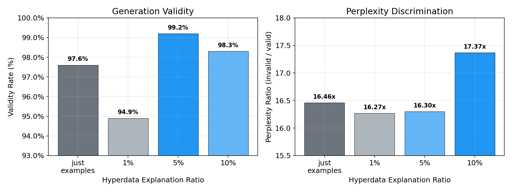
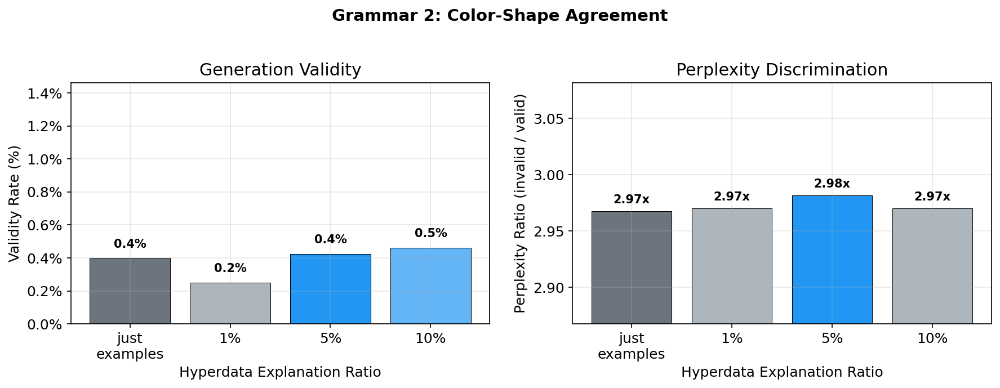
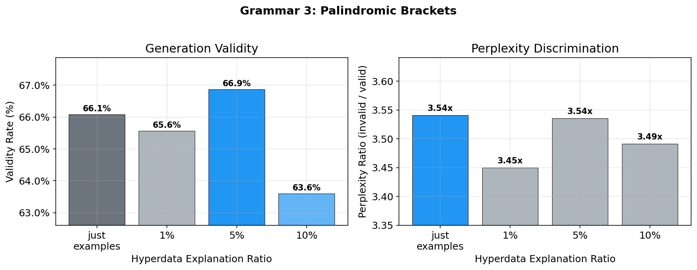

# Hyperdata Experiment: Full Results

## Overview

This report tests whether a language model learns formal grammars more effectively when natural language explanations of the grammar's rules are interleaved with training examples — a technique we call "hyperdata" — compared to training on examples alone. We evaluate across three grammars of increasing complexity.

## Experimental Setup

### Base Model

All runs use **EleutherAI/pythia-1.4b** as the base model for continued pretraining.

### Training Configuration

- **Data mix:** 10% synthetic grammar data, 90% canonical data (C4)
- **Training steps:** 5,000
- **Batch size:** 4 (with 8 gradient accumulation steps, effective batch size 32)
- **Learning rate:** 1e-5 with 1,000 warmup steps
- **Precision:** bf16
- **Max sequence length:** 512

### Training Datasets

For each grammar, four training datasets were compared, differing only in the composition of the synthetic 10%:

| Training Dataset | Synthetic Data Composition |
|---|---|
| **just examples** | 10,000 valid grammar examples |
| **hyperdata 1%** | Same examples + explanation blocks interleaved at ~1% of documents |
| **hyperdata 5%** | Same examples + explanation blocks interleaved at ~5% of documents |
| **hyperdata 10%** | Same examples + explanation blocks interleaved at ~10% of documents |

### Evaluation

- **Completion tests:** Token-probability checks at grammar decision points (does the model prefer valid continuations?)
- **Generation validity:** Generate thousands of samples and measure what percentage follows the grammar rules
- **Perplexity discrimination:** Perplexity on valid vs. invalid test sequences (higher ratio = better discrimination)

## Grammar 1: START/MID/END (Simple)

```
Valid sentence := START MID+ END
```

A valid sentence must begin with `START`, contain one or more `MID` tokens, and end with `END`.



### Results

| Training Dataset | Completion | Generation Validity | PPL Ratio |
|---|---|---|---|
| just examples | 4/4 (100%) | 97.6% | 16.46 |
| hyperdata 1% | 4/4 (100%) | 94.9% | 16.27 |
| **hyperdata 5%** | **4/4 (100%)** | **99.2%** | 16.30 |
| hyperdata 10% | 4/4 (100%) | 98.3% | **17.37** |

All training datasets learn the grammar at the token-probability level (100% completion accuracy). Hyperdata 5% achieves the best generation validity at 99.2%, outperforming the examples-only baseline (97.6%). Hyperdata 10% has the strongest perplexity discrimination (17.37x ratio).

The remaining generation failures are tokenization artifacts — the model generates valid grammar sequences but fuses punctuation to `END` (e.g., `END.`), preventing clean extraction.

## Grammar 2: Color-Shape Agreement (Medium)

```
Rule: 1-4 pairs where RED pairs with CIRCLE/SQUARE, BLUE pairs with TRIANGLE/DIAMOND
```



### Completion Tests

All training datasets pass all 4 completion tests (100% accuracy). The model learns color-shape agreement perfectly:

| Metric | just examples | 1% | 5% | 10% |
|---|---|---|---|---|
| P(CIRCLE+SQUARE \| RED) | 92.6% | 92.2% | 91.5% | 91.8% |
| P(TRIANGLE+DIAMOND \| BLUE) | 98.8% | 98.9% | 98.8% | 98.8% |
| P(RED+BLUE \| RED CIRCLE) | 98.7% | 98.5% | 98.6% | 98.4% |

### Generation Validity

| Training Dataset | Valid | Invalid | Validity Rate |
|---|---|---|---|
| just examples | 32/8,000 | 7,968 | 0.4% |
| hyperdata 1% | 20/8,000 | 7,980 | 0.25% |
| hyperdata 5% | 34/8,000 | 7,966 | 0.43% |
| hyperdata 10% | 37/8,000 | 7,963 | 0.46% |

Generation validity is near-zero across all training datasets. However, the model has learned color-shape agreement — the failures are almost entirely due to exceeding the 4-pair limit. The model generates long sequences of valid color-shape pairs (often 10+) but never stops. Example invalid generation:

> `RED CIRCLE RED CIRCLE RED SQUARE RED SQUARE RED SQUARE RED CIRCLE RED CIRCLE RED CIRCLE...`

Every pair is valid, but the model produces far more than 4. Without an explicit END token, the model has no structural signal for when to stop. The 4-pair limit is a constraint on sequence length, not on local token transitions, and the model hasn't learned it.

### Perplexity

| Training Dataset | Valid PPL | Invalid PPL | PPL Ratio |
|---|---|---|---|
| just examples | 1.357 | 4.027 | 2.97 |
| hyperdata 1% | 1.357 | 4.031 | 2.97 |
| hyperdata 5% | 1.360 | 4.054 | 2.98 |
| hyperdata 10% | 1.364 | 4.052 | 2.97 |

Perplexity ratios are essentially identical (~2.97) across all training datasets. The model discriminates valid from invalid, but no training dataset has an edge.

## Grammar 3: Palindromic Brackets (Complex)

```
Rule: Matched brackets [ ] with palindromic content (tokens A, B, C, D). Nesting allowed.
```



### Completion Tests

| Test | just examples | 1% | 5% | 10% |
|---|---|---|---|---|
| palindrome_start: After `[ A`, prefer A | pass | pass | pass | pass |
| palindrome_middle: After `[ A B`, prefer B | pass | pass | pass | pass |
| palindrome_closing: After `[ A B B`, prefer A | **fail** | pass | pass | pass |
| bracket_close: After `[ A A`, prefer `]` | pass | pass | pass | pass |
| **Accuracy** | **75%** | **100%** | **100%** | **100%** |

The examples-only model fails the palindrome_closing test: after `[ A B B`, it assigns P(B)=38.6% vs P(A)=36.8% — it slightly prefers continuing with B rather than closing the palindrome with A. All hyperdata models get this right, with 5% and 10% showing the largest margin (P(A)=40.8-41.8% vs P(B)=32.5-35.5%).

### Generation Validity

| Training Dataset | Valid | Invalid | Validity Rate |
|---|---|---|---|
| just examples | 3,965/6,000 | 2,035 | 66.1% |
| hyperdata 1% | 3,934/6,000 | 2,066 | 65.6% |
| **hyperdata 5%** | **4,012/6,000** | **1,988** | **66.9%** |
| hyperdata 10% | 3,816/6,000 | 2,184 | 63.6% |

Generation validity is moderate (~64-67%) and similar across training datasets. Hyperdata 5% leads slightly at 66.9%, while 10% is the weakest at 63.6%. The palindrome constraint is genuinely difficult — the model must track and mirror content tokens across the full sequence, which requires non-local dependencies that are hard for autoregressive models.

Per-prompt breakdown:

| Training Dataset | `[` | `[ A` | `[ A A` |
|---|---|---|---|
| just examples | 67.4% | 58.2% | 72.7% |
| hyperdata 1% | 65.6% | 56.4% | 74.8% |
| hyperdata 5% | 67.5% | 60.6% | 72.5% |
| hyperdata 10% | 64.1% | 56.5% | 70.3% |

The `[ A A` prompt achieves the highest validity across all training datasets (~70-75%) because the palindrome is already set up — the model just needs to generate `]`.

### Perplexity

| Training Dataset | Valid PPL | Invalid PPL | PPL Ratio |
|---|---|---|---|
| just examples | 3.460 | 12.253 | **3.54** |
| hyperdata 1% | 3.494 | 12.054 | 3.45 |
| **hyperdata 5%** | **3.458** | 12.226 | 3.54 |
| hyperdata 10% | 3.509 | 12.248 | 3.49 |

Perplexity ratios are similar (~3.45-3.54). Examples-only and hyperdata 5% are tied for the best discrimination.

## Cross-Grammar Comparison


### Summary Table

| Grammar | Best Completion | Best Generation | Best PPL Ratio |
|---|---|---|---|
| Grammar 1 (simple) | all tied at 100% | hyperdata 5% (99.2%) | hyperdata 10% (17.37x) |
| Grammar 2 (medium) | all tied at 100% | all near 0% | all tied (~2.97x) |
| Grammar 3 (complex) | hyperdata 1/5/10% (100%) | hyperdata 5% (66.9%) | examples / hyperdata 5% (3.54x) |

### Key Findings

1. **Hyperdata consistently helps completion tests on complex grammars.** For grammar 3, examples-only achieves 75% while all hyperdata variants achieve 100%. The specific test that benefits — palindrome closing — requires understanding a non-local dependency (mirroring the opening token), exactly the kind of rule that natural language explanations can articulate but that may be hard to extract from examples alone.

2. **Hyperdata 5% tends to produce the best generation quality.** It leads generation validity on grammars 1 and 3 (99.2% and 66.9% respectively). The pattern from grammar 1 holds: too little hyperdata (1%) can hurt, too much (10%) dilutes example-based learning, and 5% is the sweet spot.

3. **Grammar 2's generation failure reveals a limitation of the approach.** The model learns local token transitions (color-shape agreement) perfectly but cannot learn a global sequence-length constraint (max 4 pairs) without an explicit stopping signal. This is a structural limitation of autoregressive training on grammar 2 — the 4-pair limit has no token-level marker, so the model has no way to learn when to stop.

4. **Perplexity discrimination shows no consistent hyperdata advantage.** PPL ratios are similar across training datasets for grammars 2 and 3. Grammar 1's hyperdata 10% has a slightly higher ratio (17.37 vs ~16.3), but the effect is small.

5. **Grammar complexity matters more than training dataset composition.** The jump from grammar 1 (99.2% validity) to grammar 3 (66.9%) is far larger than any within-grammar difference between training datasets. Hyperdata helps at the margins, but the fundamental difficulty of the grammar dominates.

## Caveats

- All training datasets use the same random seed and training hyperparameters. The results reflect a single training run per training dataset with no repetition.
- Grammar 2's near-zero generation validity is primarily a grammar design issue (no END token) rather than a failure of the training approach.
- The generation extraction heuristics differ by grammar and may affect validity numbers. Grammar 1 stops at the first `END`, grammar 2 extracts all contiguous color-shape pairs, and grammar 3 stops at the first matched bracket.
